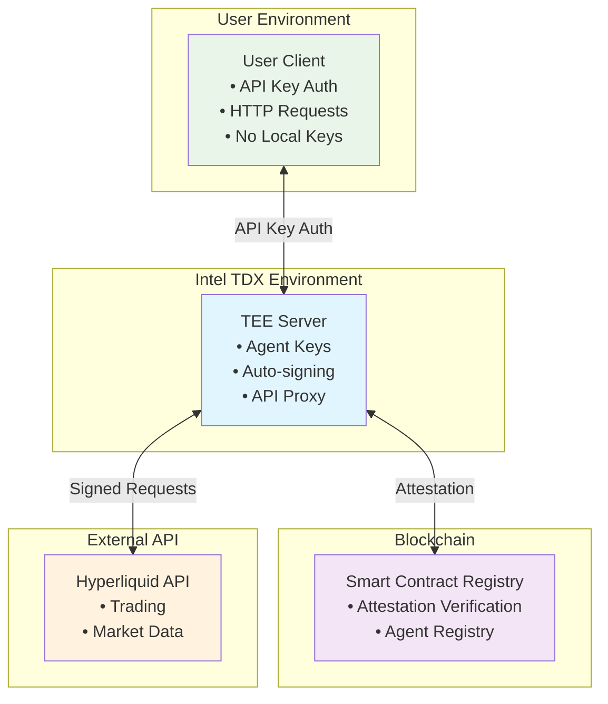

# TEE-Secured Hyperliquid Agent Wallet

> **🏆 Submission for hlh.builders Hackathon**

A secure implementation of Hyperliquid agent wallets hosted on remote Intel TDX (Trusted Execution Environment) machines, eliminating the need for users to store agent keys locally while maintaining verifiable security through on-chain attestation.

## Overview

This project demonstrates how Hyperliquid agent wallets can be fully hosted on remote TEE machines with cryptographic verification. Users interact with their agent wallets through API keys without ever handling private keys directly, while smart contracts verify the TEE attestation to ensure the remote environment is secure and uncompromised.

### Key Innovation

- **Zero Local Key Storage**: Agent private keys never leave the TEE environment
- **Verifiable Security**: Intel TDX attestation reports verified on-chain
- **Drop-in API Replacement**: Transparent proxy for Hyperliquid API with additional security
- **Remote Agent Management**: Full agent wallet functionality without local setup

## Architecture



## Demo Walkthrough

### Step 1: Deploy Registry Contract
```bash
# Deploy the TEE attestation registry to HyperEVM
cd contracts
forge script script/Deploy.s.sol --broadcast --rpc-url hyperliquid_testnet
```

### Step 2: Set Up TEE Server
```bash
# Initialize the TDX server with attestation
cd tdx-server
cargo run --bin setup-attestation
```

### Step 3: Register Agent in TEE
```bash
# Generate agent wallet and register with attestation
curl -X POST http://tdx-server:8080/register-agent \
  -H "Content-Type: application/json" \
  -d '{"user_id": "demo_user"}'
```

### Step 4: Submit Quote to Registry
```bash
# Register the TDX quote on-chain (returns agent address and API key from step 3)
cast send $REGISTRY_ADDRESS "registerAgent(bytes)" $TDX_QUOTE_HEX \
  --private-key $PRIVATE_KEY \
  --rpc-url hyperliquid_testnet \
  --value 0.01ether
```

### Step 5: Verify Agent Registration
```bash
# Check if agent is registered on-chain
cast call $REGISTRY_ADDRESS "isAgentRegistered(address)" $AGENT_ADDRESS \
  --rpc-url hyperliquid_testnet
```

### Step 6: Use API Key for Trading
```bash
# Use API key to interact with agent (no local keys needed)
curl -X POST http://tdx-server:8080/exchange/order \
  -H "X-API-Key: your_api_key" \
  -H "Content-Type: application/json" \
  -d '{
    "coin": "ETH", 
    "is_buy": true, 
    "sz": 0.1, 
    "limit_px": 3000
  }'
```

## Components

### 🔐 Smart Contract Registry (`/contracts`)
- **Registry.sol**: Transparent append-only log of verified TEE agents
- **AttestationHelper.sol**: Library for parsing TDX quotes and extracting agent addresses
- **TDXStructs.sol**: Data structures for Intel TDX attestation
- Integrates with Automata DCAP v1.1 deployed on HyperEVM
- Built with Foundry for Hyperliquid deployment

### 🖥️ TEE API Server (`/tdx-server`)
- **Pure Rust Implementation**: TEE attestation and key management using Automata TDX SDK
- **Hyperliquid Integration**: Direct API proxy with automatic signing
- **API Key Auth**: Secure access without exposing agent keys
- **Request Routing**: Transparent passthrough for `/info`, interception for `/exchange`

### 📚 Documentation (`/docs`)
- Architecture deep-dive
- Security model explanation
- Integration examples

## Security Model

1. **TEE Isolation**: Agent keys generated and stored only in Intel TDX
2. **Attestation Verification**: Smart contract verifies TEE measurements
3. **API Key Isolation**: User authentication separate from agent keys
4. **Transparent Signing**: All transactions signed within verified TEE

## Getting Started

### Prerequisites
- Intel TDX-enabled hardware (for production)
- Foundry for smart contract development
- Rust toolchain (1.70+) for server implementation

### Quick Setup
```bash
# Clone and initialize
git clone <repo>
cd agent-wallet

# Set up contracts
cd contracts && forge install

# Set up Rust server
cd ../tdx-server && cargo build --release
```

## Development Status

- [x] Project structure and documentation
- [x] Smart contract implementation (Registry + AttestationHelper)
- [x] TDX protocol specification and data structures
- [x] Automata DCAP integration on HyperEVM
- [x] Comprehensive test suite
- [ ] TEE server core functionality
- [ ] API proxy implementation
- [ ] Integration testing
- [ ] Demo deployment

## Protocol Documentation

- **[Protocol Specification](docs/PROTOCOL.md)**: Complete specification for embedding agent addresses in TDX quotes
- **[Deployment Guide](docs/DEPLOYMENT.md)**: Contract addresses and deployment instructions
- **[Smart Contracts](contracts/src/)**: Registry and helper contracts with full documentation

## Contributing

This project is built for the hlh.builders hackathon. For questions or collaboration, please open an issue.

## License

MIT License - see LICENSE file for details.