# TEE-Secured Hyperliquid Agent Wallet

> **🏆 Submission for hlh.builders Hackathon**

A secure implementation of Hyperliquid agent wallets hosted on remote Intel TDX (Trusted Execution Environment) machines, eliminating the need for users to store agent keys locally while maintaining verifiable security through on-chain attestation.

## Overview

This project demonstrates how Hyperliquid agent wallets can be fully hosted on remote TEE machines with cryptographic verification. Users interact with their agent wallets through API keys without ever handling private keys directly, while smart contracts verify the TEE attestation to ensure the remote environment is secure and uncompromised.

### Key Innovation

- **Zero Local Key Storage**: Agent private keys never leave the TEE environment
- **Verifiable Security**: Intel TDX attestation reports verified on-chain
- **Drop-in API Replacement**: Transparent proxy for Hyperliquid API with additional security
- **Remote Agent Management**: Full agent wallet functionality without local setup

## Architecture

```mermaid
graph TB
    subgraph "User Environment"
        UC[User Client<br/>• API Key Auth<br/>• HTTP Requests<br/>• No Local Keys]
    end
    
    subgraph "Intel TDX Environment"
        TEE[TEE Server<br/>• Agent Keys<br/>• Auto-signing<br/>• API Proxy]
    end
    
    subgraph "Blockchain"
        SC[Smart Contract Registry<br/>• Attestation Verification<br/>• Agent Registry]
    end
    
    subgraph "External API"
        HL[Hyperliquid API<br/>• Trading<br/>• Market Data]
    end
    
    UC <-->|API Key Auth| TEE
    TEE <-->|Attestation| SC
    TEE <-->|Signed Requests| HL
    
    style TEE fill:#e1f5fe
    style SC fill:#f3e5f5
    style UC fill:#e8f5e8
    style HL fill:#fff3e0
```



## Demo Walkthrough

### Step 1: Deploy Registry Contract
```bash
# Deploy the TEE attestation registry
cd contracts
forge script script/Deploy.s.sol --broadcast --rpc-url <HYPERLIQUID_RPC>
```

### Step 2: Set Up TEE Server
```bash
# Initialize the TDX server with attestation
cd tdx-server
cargo run --bin setup-attestation
```

### Step 3: Register Agent in TEE
```bash
# Generate agent wallet and register with attestation
curl -X POST http://tdx-server:8080/register-agent \
  -H "Content-Type: application/json" \
  -d '{"user_id": "demo_user"}'
```

### Step 4: Verify On-Chain Registration
```bash
# Verify the TEE attestation is recorded on-chain
cast call $REGISTRY_ADDRESS "verifyAgent(address)" $AGENT_ADDRESS
```

### Step 5: Use API Key for Trading
```bash
# Use API key to interact with agent (no local keys needed)
curl -X POST http://tdx-server:8080/exchange/order \
  -H "X-API-Key: your_api_key" \
  -H "Content-Type: application/json" \
  -d '{
    "coin": "ETH", 
    "is_buy": true, 
    "sz": 0.1, 
    "limit_px": 3000
  }'
```

## Components

### 🔐 Smart Contract Registry (`/contracts`)
- **Registry.sol**: Verifies Intel TDX attestation reports
- **AgentManager.sol**: Manages registered agent wallets
- Built with Foundry for Hyperliquid deployment

### 🖥️ TEE API Server (`/tdx-server`)
- **Rust Core**: TEE attestation and key management
- **Python Proxy**: Hyperliquid API integration
- **API Key Auth**: Secure access without exposing keys
- **Auto-signing**: Transparent transaction signing

### 📚 Documentation (`/docs`)
- Architecture deep-dive
- Security model explanation
- Integration examples

## Security Model

1. **TEE Isolation**: Agent keys generated and stored only in Intel TDX
2. **Attestation Verification**: Smart contract verifies TEE measurements
3. **API Key Isolation**: User authentication separate from agent keys
4. **Transparent Signing**: All transactions signed within verified TEE

## Getting Started

### Prerequisites
- Intel TDX-enabled hardware (for production)
- Foundry for smart contract development
- Rust and Python for server components

### Quick Setup
```bash
# Clone and initialize
git clone <repo>
cd agent-wallet

# Set up contracts
cd contracts && forge install

# Set up server
cd ../tdx-server && cargo build
pip install -r python/requirements.txt
```

## Development Status

- [x] Project structure and documentation
- [ ] Smart contract implementation
- [ ] TEE server core functionality
- [ ] API proxy implementation
- [ ] Integration testing
- [ ] Demo deployment

## Contributing

This project is built for the hlh.builders hackathon. For questions or collaboration, please open an issue.

## License

MIT License - see LICENSE file for details.