# HyperETH Verifiable Agent Service

> **🏆 Submission for [hlh.builders](https://hlh.builders/) Hackathon**

A secure implementation of Hyperliquid agent wallets hosted on remote Intel TDX (Trusted Execution Environment) machines, eliminating the need for users to store agent keys locally while maintaining verifiable security through on-chain attestation.


## Overview

This project demonstrates how Hyperliquid agent wallets can be fully hosted on remote TEE machines with cryptographic verification. Users interact with their agent wallets through API keys without ever handling private keys directly, while smart contracts verify the TEE attestation to ensure the remote environment is secure and uncompromised.

### Key Innovation

- **Zero Local Key Storage**: Agent private keys never leave the TEE environment
- **Verifiable Security**: Intel TDX attestation reports verified on-chain
- **Drop-in API Replacement**: Transparent proxy for Hyperliquid API with additional security
- **Remote Agent Management**: Full agent wallet functionality without local setup

## Architecture

```mermaid
graph TB
    subgraph "User Environment"
        UC[User Client<br/>• API Key Auth<br/>• HTTP Requests<br/>• No Local Keys]
    end
    
    subgraph "Intel TDX Environment"
        TEE[TEE Server<br/>• Agent Keys<br/>• Auto-signing<br/>• API Proxy]
    end
    
    subgraph "Blockchain"
        SC[Smart Contract Registry<br/>• Attestation Verification<br/>• Agent Registry]
    end
    
    subgraph "External API"
        HL[Hyperliquid API<br/>• Trading<br/>• Market Data]
    end
    
    UC <-->|API Key Auth| TEE
    TEE <-->|Attestation| SC
    TEE <-->|Signed Requests| HL
    
    style TEE fill:#e1f5fe
    style SC fill:#f3e5f5
    style UC fill:#e8f5e8
    style HL fill:#fff3e0
```



## Demo Walkthrough

### Step 1: Set Up TEE Server
```bash
# Initialize and start the TDX server
cd tdx-server
cargo run --bin server
# Server will start on http://localhost:8080
```

### Step 2: Set Up Frontend
```bash
# In a new terminal, start the React frontend
cd frontend
npm install
npm run dev
# Frontend will start on http://localhost:5173
```

### Step 3: Continue Demo in Frontend
Open your browser to `http://localhost:5173` and use the web interface to:

- **Register Agent**: Create a new agent wallet in the TEE environment
- **View Agent Details**: See your agent address and API key
- **Submit Trading Orders**: Place orders through the secure TEE proxy
- **Monitor Activity**: Track your agent's trading activity

The frontend provides a complete interface for all agent wallet operations without requiring command-line interactions.

## Components

### 🔐 Smart Contract Registry (`/contracts`)
- **Registry.sol**: Transparent append-only log of verified agents
- **AttestationHelper.sol**: Library for parsing TDX quotes and extracting agent addresses
- **TDXStructs.sol**: Data structures for Intel TDX attestation
- Integrates with Automata DCAP v1.1 deployed on HyperEVM
- Built with Foundry for Hyperliquid deployment

### 🖥️ TEE API Server (`/tdx-server`)
- **Pure Rust Implementation**: TEE attestation and key management using Automata TDX SDK
- **Hyperliquid Integration**: Direct API proxy with automatic signing
- **API Key Auth**: Secure access without exposing agent keys
- **Request Routing**: Transparent passthrough for `/info`, interception for `/exchange`

### 🌐 Frontend Interface (`/frontend`)
- **React + Vite**: Modern web interface for agent wallet management
- **Agent Registration**: User-friendly wizard for creating new agent wallets
- **Trading Interface**: Intuitive forms for submitting Hyperliquid orders
- **Real-time Updates**: Live monitoring of agent activity and trading status

### 📚 Documentation (`/docs`)
- Architecture deep-dive
- Security model explanation
- Integration examples

## Security Model

1. **TEE Isolation**: Agent keys generated and stored only in Intel TDX
2. **Attestation Verification**: Smart contract verifies TEE measurements
3. **API Key Isolation**: User authentication separate from agent keys
4. **Transparent Signing**: All transactions signed within verified TEE

## Getting Started

### Prerequisites
- Intel TDX-enabled hardware (for production)
- Foundry for smart contract development
- Rust toolchain (1.70+) for server implementation
- Node.js (18+) for frontend development

## Development Status

- [x] Project structure and documentation
- [x] Smart contract implementation (Registry + AttestationHelper)
- [x] TDX protocol specification and data structures
- [x] Automata DCAP integration on HyperEVM
- [x] Comprehensive test suite
- [x] Server core functionality
- [x] API proxy implementation
- [x] Integration testing
- [x] Local deployment
- [ ] TEE deployment
- [ ] On-chain registry integration
- [ ] Production hardening
- [ ] Security audit

## Protocol Documentation

- **[Protocol Specification](docs/protocol.md)**: Complete specification for embedding agent addresses in TDX quotes
- **[Deployment Guide](docs/deployment.md)**: Contract addresses and deployment instructions
- **[Smart Contracts](contracts/src/)**: Registry and helper contracts with full documentation

## Contributing

This project is built for the [hlh.builders](https://hlh.builders/) hackathon. For questions or collaboration, please open an issue.

## License

MIT License - see LICENSE file for details.
