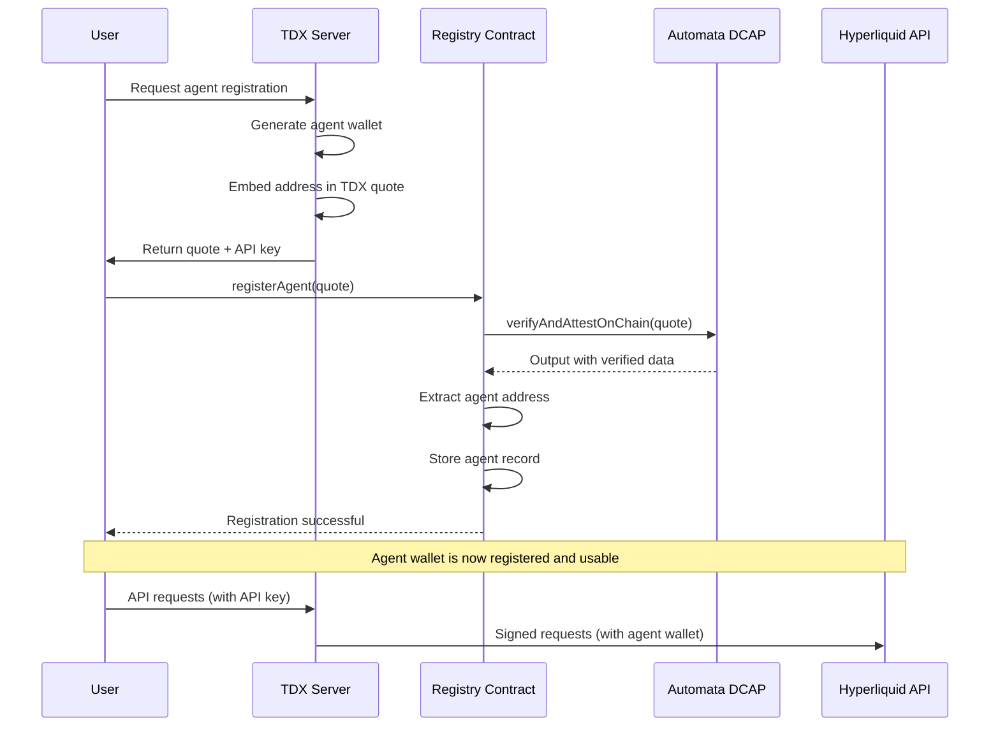

# TEE Agent Wallet Protocol Specification

## Overview

The TEE Agent Wallet Protocol enables secure registration and verification of Hyperliquid agent wallets hosted in Intel TDX (Trusted Execution Environment) environments. The protocol embeds agent wallet addresses within TDX attestation quotes and verifies them on-chain using Automata's DCAP attestation infrastructure.

## Protocol Architecture



## Report Data Format

The TDX quote contains a 64-byte `reportData` field where the agent wallet address is embedded:

| Offset | Size | Content | Description |
|--------|------|---------|-------------|
| 0-31   | 32   | `0x00...` | Reserved for future use |
| 32-43  | 12   | `"HYPERLIQUID\0"` | Protocol identifier |
| 44-63  | 20   | Agent Address | 20-byte Ethereum address |

### Protocol Identifier

The protocol uses the identifier `"HYPERLIQUID\0"` (12 bytes) to distinguish agent registration quotes from other TDX quotes:

```
Hex: 0x48595045524c49515549440000
ASCII: HYPERLIQUID\0
```

## Server-Side Implementation (Rust)

### Quote Generation with Agent Address

```rust
use tdx::{Tdx, device::DeviceOptions};

fn generate_agent_quote(agent_address: [u8; 20]) -> Result<Vec<u8>, Box<dyn Error>> {
    // Prepare 64-byte report data
    let mut report_data = [0u8; 64];
    
    // Bytes 0-31: Reserved (zeros)
    // Bytes 32-43: Protocol identifier
    report_data[32..44].copy_from_slice(b"HYPERLIQUID\0");
    
    // Bytes 44-63: Agent wallet address
    report_data[44..64].copy_from_slice(&agent_address);
    
    // Generate TDX attestation quote
    let tdx = Tdx::new();
    let (quote, _) = tdx.get_attestation_report_with_options(
        DeviceOptions {
            report_data: Some(report_data),
        }
    )?;
    
    // Convert to raw bytes for transmission
    Ok(quote.to_bytes())
}
```

### Complete Server Workflow

```rust
use secp256k1::{Secp256k1, SecretKey};
use rand::rngs::OsRng;

pub struct TdxAgentServer {
    tdx: Tdx,
    agents: HashMap<String, AgentWallet>,
    api_keys: HashMap<String, String>, // api_key -> agent_id
}

impl TdxAgentServer {
    pub fn register_agent(&mut self, user_id: &str) -> Result<RegistrationResponse, Error> {
        // 1. Generate new agent wallet
        let secp = Secp256k1::new();
        let secret_key = SecretKey::new(&mut OsRng);
        let public_key = secret_key.public_key(&secp);
        let agent_address = public_key_to_address(&public_key);
        
        // 2. Generate TDX quote with embedded address
        let quote_bytes = self.generate_agent_quote(agent_address)?;
        
        // 3. Store agent wallet securely in TEE
        let agent_wallet = AgentWallet {
            secret_key,
            public_key,
            address: agent_address,
        };
        self.agents.insert(user_id.to_string(), agent_wallet);
        
        // 4. Generate API key for user authentication
        let api_key = generate_secure_api_key();
        self.api_keys.insert(api_key.clone(), user_id.to_string());
        
        Ok(RegistrationResponse {
            agent_address,
            quote_bytes,
            api_key,
        })
    }
    
    pub fn handle_trading_request(&self, api_key: &str, request: TradingRequest) 
        -> Result<Response, Error> {
        // 1. Authenticate user
        let user_id = self.api_keys.get(api_key)
            .ok_or(Error::InvalidApiKey)?;
            
        // 2. Get agent wallet
        let agent = self.agents.get(user_id)
            .ok_or(Error::AgentNotFound)?;
            
        // 3. Sign and submit request to Hyperliquid
        let signed_request = agent.sign_request(request)?;
        self.submit_to_hyperliquid(signed_request)
    }
}
```

## Contract-Side Implementation (Solidity)

### Quote Verification and Parsing

```solidity
function registerAgent(bytes calldata tdxQuote) external payable returns (uint256 recordId) {
    // 1. Verify quote with Automata DCAP
    (bool success, bytes memory outputData) = DCAP_VERIFIER.verifyAndAttestOnChain{value: msg.value}(tdxQuote);
    require(success, "Quote verification failed");
    
    // 2. Parse Automata output
    Output memory output = abi.decode(outputData, (Output));
    require(output.quoteVersion == 4, "Not TDX quote");
    require(output.quoteBodyType == 2, "Not TD10 report");
    
    // 3. Parse TD10 report body
    TD10ReportBody memory reportBody = parseTD10Report(output.quoteBody);
    
    // 4. Validate protocol identifier
    require(hasValidProtocolId(reportBody.reportData), "Invalid protocol");
    
    // 5. Extract agent address
    address agentAddress = extractAgentAddress(reportBody.reportData);
    require(agentAddress != address(0), "Invalid agent address");
    
    // 6. Store agent record
    recordId = agents.length;
    agents.push(AgentRecord({
        agentAddress: agentAddress,
        registeredBy: msg.sender,
        mrTd: bytes32(reportBody.mrTd),
        mrConfigId: bytes32(reportBody.mrConfigId),
        mrOwner: bytes32(reportBody.mrOwner),
        tcbStatus: output.tcbStatus,
        timestamp: block.timestamp
    }));
    
    // 7. Update mappings and emit event
    agentRecords[agentAddress].push(recordId);
    isRegisteredAgent[agentAddress] = true;
    
    emit AgentRegistered(recordId, agentAddress, msg.sender, bytes32(reportBody.mrTd), output.tcbStatus);
}
```

### Address Extraction Algorithm

```solidity
function extractAgentAddress(bytes64 reportData) internal pure returns (address) {
    bytes memory data = abi.encodePacked(reportData);
    
    // Validate protocol identifier (bytes 32-43)
    bytes12 protocolId;
    assembly {
        protocolId := mload(add(data, 64)) // 32 + 32 for length prefix
    }
    require(protocolId == 0x48595045524c49515549440000, "Invalid protocol");
    
    // Extract agent address (bytes 44-63)
    address agentAddress;
    assembly {
        agentAddress := mload(add(data, 76)) // 44 + 32 for length prefix
    }
    require(agentAddress != address(0), "Zero address");
    
    return agentAddress;
}
```

## TDX Quote Structure

### TD10 Report Body Layout (584 bytes)

| Offset | Size | Field | Description |
|--------|------|-------|-------------|
| 0      | 16   | `teeTcbSvn` | TEE TCB Security Version |
| 16     | 48   | `mrSeam` | SEAM measurement |
| 64     | 48   | `mrsignerSeam` | SEAM signer measurement |
| 112    | 8    | `seamAttributes` | SEAM attributes |
| 120    | 8    | `tdAttributes` | TD attributes |
| 128    | 8    | `xFAM` | Extended features |
| 136    | 48   | `mrTd` | **TD measurement (identity)** |
| 184    | 48   | `mrConfigId` | **Config measurement** |
| 232    | 48   | `mrOwner` | **Owner measurement** |
| 280    | 48   | `mrOwnerConfig` | Owner config measurement |
| 328    | 48   | `rtMr0` | Runtime measurement 0 |
| 376    | 48   | `rtMr1` | Runtime measurement 1 |
| 424    | 48   | `rtMr2` | Runtime measurement 2 |
| 472    | 48   | `rtMr3` | Runtime measurement 3 |
| **520** | **64** | **`reportData`** | **Agent address embedded here** |

The key measurements (`mrTd`, `mrConfigId`, `mrOwner`) are stored on-chain for verification and audit purposes.

## Security Considerations

### TEE Security Properties

1. **Confidentiality**: Agent private keys never leave the TDX environment
2. **Integrity**: TDX measurements ensure code hasn't been tampered with
3. **Authenticity**: Intel attestation proves execution in genuine TDX
4. **Non-repudiation**: All registrations are logged immutably on-chain

### Protocol Security

1. **Protocol Identifier**: Prevents accidental registration of non-agent quotes
2. **Address Validation**: Ensures non-zero agent addresses
3. **Measurement Storage**: Enables verification of TEE state
4. **Transparent Registry**: All registrations are publicly auditable

### Attack Vectors & Mitigations

| Attack | Mitigation |
|--------|------------|
| Fake quotes | Automata DCAP cryptographic verification |
| Address collisions | Secp256k1 provides 2^160 address space |
| TEE compromise | Measurements stored on-chain for detection |
| Replay attacks | Quotes contain timestamps and nonces |
| API key theft | Keys only grant API access, not wallet control |

## Integration Examples

### Frontend Integration

```typescript
// Register agent with quote
const response = await fetch('/register-agent', {
  method: 'POST',
  headers: { 'Content-Type': 'application/json' },
  body: JSON.stringify({ userId: 'user123' })
});

const { agentAddress, quote, apiKey } = await response.json();

// Submit to Registry contract
const tx = await registry.registerAgent(quote, { value: ethers.utils.parseEther("0.01") });
const receipt = await tx.wait();

// Use API key for trading
const tradingResponse = await fetch('/exchange/order', {
  method: 'POST',
  headers: {
    'X-API-Key': apiKey,
    'Content-Type': 'application/json'
  },
  body: JSON.stringify({
    coin: 'ETH',
    is_buy: true,
    sz: 0.1,
    limit_px: 3000
  })
});
```

### Query Agent Information

```solidity
// Check if agent is registered
bool isRegistered = registry.isAgentRegistered(agentAddress);

// Get latest record
AgentRecord memory record = registry.getLatestAgentRecord(agentAddress);

// Verify measurements match expected values
require(record.mrTd == expectedMrTd, "TD measurement mismatch");
require(record.tcbStatus <= MAX_ACCEPTABLE_TCB_STATUS, "TCB status too low");
```

## Future Extensions

### Reserved Space Usage

The 32 reserved bytes (0-31) in `reportData` can be used for future protocol extensions:

- **Version field**: Protocol version for backward compatibility
- **Metadata**: Additional agent configuration
- **Signatures**: Multi-sig or delegation support
- **Timestamps**: Quote generation timestamps

### Multi-Network Support

The protocol can be extended to support multiple networks by including network identifiers in the reserved space:

```
Bytes 0-3:   Protocol version (4 bytes)
Bytes 4-7:   Network identifier (4 bytes)
Bytes 8-31:  Reserved for future use (24 bytes)
Bytes 32-43: "HYPERLIQUID\0" (12 bytes)
Bytes 44-63: Agent address (20 bytes)
```

This enables cross-chain agent verification and interoperability.