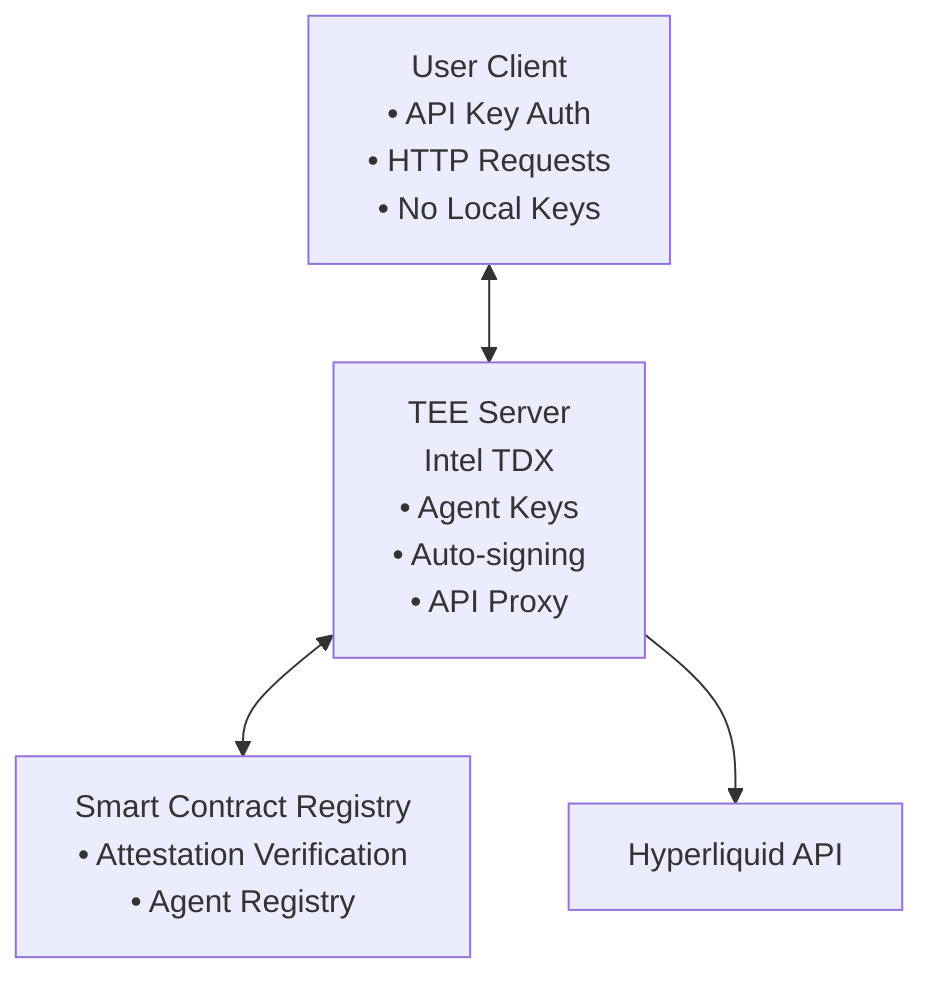
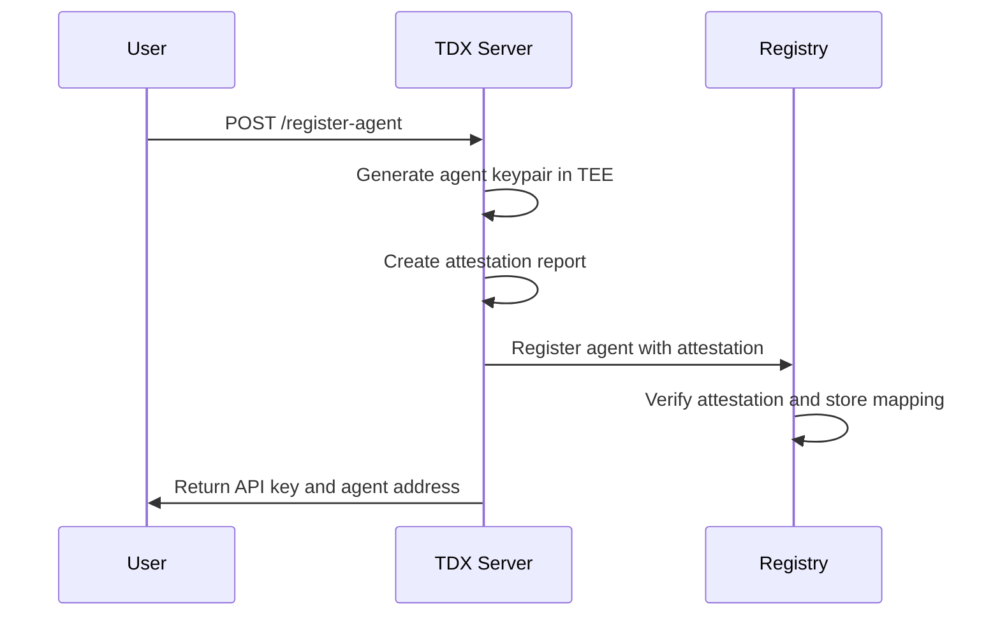
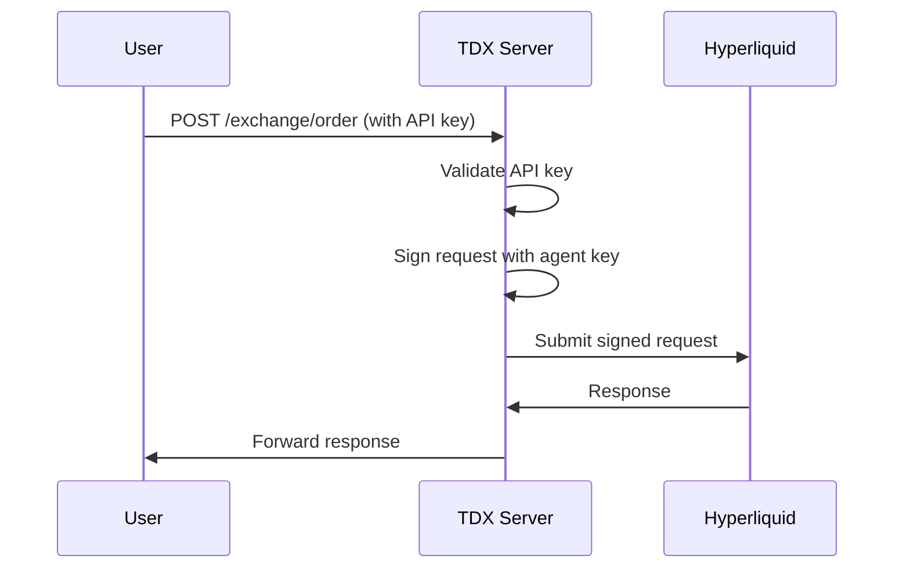
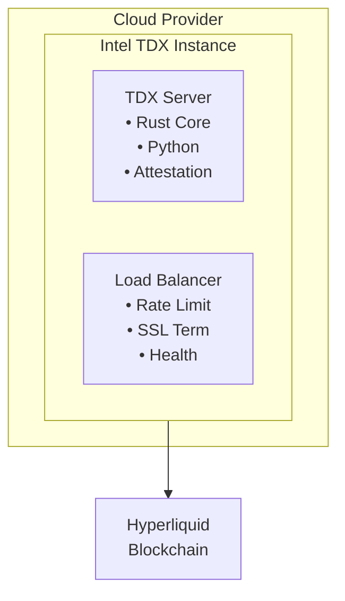

# Architecture Overview

## System Architecture

The TEE-Secured Hyperliquid Agent Wallet system consists of three main components that work together to provide secure, remote agent wallet management:

## Component Details

### 1. Smart Contract Registry (`/contracts`)

**Purpose**: Provides on-chain verification of Intel TDX attestation reports and maintains a registry of verified agent wallets.

**Key Functions**:
- Verify Intel TDX attestation reports
- Register agent wallet addresses with verified attestation
- Maintain user-to-agent mappings
- Provide public verification of agent authenticity

**Security Model**:
- Cryptographic verification of TDX attestation quotes
- MRENCLAVE validation to ensure code integrity
- MRSIGNER validation to verify trusted publisher
- Immutable on-chain record of verified agents

### 2. TDX Server (`/tdx-server`)

**Purpose**: Runs inside Intel TDX environment to securely manage agent keys and proxy Hyperliquid API requests.

**Components**:

#### Rust Core
- **Agent Key Management**: Generate, store, and use agent private keys
- **TDX Attestation**: Create verifiable attestation reports
- **API Authentication**: Validate user API keys
- **HTTP Server**: Main API endpoints

#### Python Proxy
- **Hyperliquid Integration**: Direct API communication
- **Request Signing**: Automatic transaction signing
- **Validation**: Request validation and security checks

**Security Model**:
- All agent keys generated and stored only within TDX
- No key material ever leaves the secure enclave
- Attestation provides cryptographic proof of environment integrity
- API keys provide user authentication without key exposure

### 3. User Client

**Purpose**: Provides interface for users to interact with their agent wallets without handling private keys.

**Capabilities**:
- Register new agents via TDX server
- Submit trading requests using API keys
- Verify agent registration on-chain
- Monitor trading activity

## Data Flow

### Agent Registration Flow

### Trading Request Flow

## Security Guarantees

### 1. Key Isolation
- Agent private keys never exist outside Intel TDX environment
- Keys generated using hardware-backed randomness
- Memory protection via TDX isolation

### 2. Code Integrity
- TDX attestation proves exact code running in enclave
- MRENCLAVE measurement ensures no tampering
- Reproducible builds for verification

### 3. Attestation Verification
- Smart contract cryptographically verifies TDX quotes
- Remote attestation provides trust anchor
- Public verification of agent authenticity

### 4. API Security
- API keys separate from agent keys
- Rate limiting and request validation
- Secure key management for user authentication

## Trust Model

### What Users Must Trust
1. **Intel TDX Technology**: Hardware-level isolation and attestation
2. **Smart Contract Code**: Open source and auditable registry logic
3. **TDX Server Code**: Open source and reproducible builds

### What Users Don't Need to Trust
1. **Server Operator**: Cannot access agent keys
2. **Network Infrastructure**: All sensitive operations in TEE
3. **Local Environment**: No key storage requirements

## Deployment Architecture

### Production Deployment

### Development Environment

For development and testing, the system can run without actual TDX hardware using:
- Software attestation simulation
- Mock TDX libraries
- Local testing with emulated secure environment

## Implementation Phases

### Phase 1: Foundation ✅
- [x] Project structure and documentation
- [x] Smart contract registry framework
- [x] TDX server architecture design

### Phase 2: Core Implementation
- [ ] Complete Registry.sol with TDX verification
- [ ] Implement agent key management
- [ ] Basic API proxy functionality

### Phase 3: Integration
- [ ] Full Hyperliquid API integration
- [ ] Comprehensive testing
- [ ] Security audit

### Phase 4: Production
- [ ] TDX environment deployment
- [ ] Production hardening
- [ ] Monitoring and maintenance