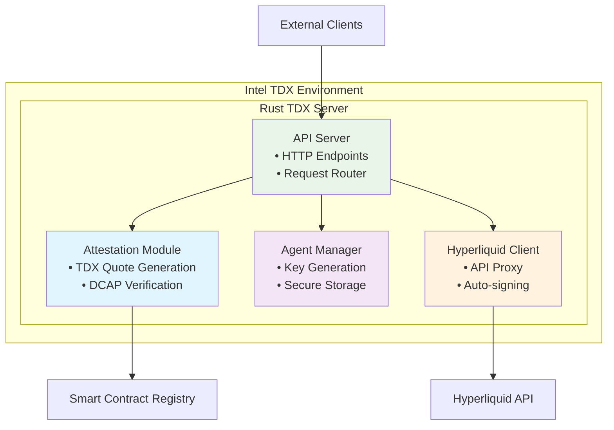

# TDX Agent Server

Pure Rust TEE-secured API server running in Intel TDX environment for managing Hyperliquid agent wallets.

## Overview

This server runs inside an Intel TDX (Trusted Execution Environment) and provides:

- **Agent Key Management**: Generate and store agent keys securely within TEE
- **TDX Attestation**: Create verifiable attestation reports using Automata TDX SDK
- **API Proxy**: Transparent proxy for Hyperliquid API with automatic signing
- **API Key Authentication**: Secure access without exposing agent private keys

## Architecture



## Components

### Attestation Module (`src/attestation.rs`)
- **TDX Quote Generation**: Create attestation reports using Automata SDK
- **Verification**: Validate TDX measurements and signatures
- **Registry Integration**: Submit attestations to smart contract

### Agent Manager (`src/agent.rs`)
- **Secure Key Generation**: Create agent keypairs within TEE
- **Key Storage**: Encrypted in-memory key management
- **Signing Interface**: Sign Hyperliquid transactions automatically

### API Server (`src/server.rs`)
- **Request Routing**: Handle `/info`, `/exchange`, and TEE-specific endpoints
- **Authentication**: API key validation middleware
- **Proxy Logic**: Transparent passthrough with selective interception

### Hyperliquid Client (`src/hyperliquid.rs`)
- **API Integration**: Direct communication with Hyperliquid endpoints
- **Request Signing**: Automatic ECDSA signature generation
- **Protocol Compliance**: Proper nonce handling and message formatting

## API Endpoints

### TEE Management
- `POST /register-agent` - Register new agent with TDX attestation
- `GET /agents/{user_id}` - Get agent information
- `GET /attestation` - Get current TDX attestation report
- `GET /health` - Server health check

### Hyperliquid Proxy
- `POST /info` - Proxy read-only info requests (passthrough)
- `POST /exchange` - Proxy exchange requests with auto-signing

## Request Flow

### Info Requests (Passthrough)
```
Client → TDX Server → Hyperliquid API → TDX Server → Client
```

### Exchange Requests (With Signing)
```
Client → TDX Server → [Validate API Key] → [Sign with Agent Key] → Hyperliquid API → Response
```

### Agent Registration
```
Client → TDX Server → [Generate Keys in TEE] → [Create Attestation] → Smart Contract → Response
```

## Security Model

1. **TEE Isolation**: All agent keys generated and stored only in TDX
2. **Attestation Verification**: Cryptographic proof of TEE integrity via Automata SDK
3. **API Key Separation**: User authentication independent of agent keys
4. **Automatic Signing**: Transparent signing within verified environment

## Development Setup

### Prerequisites
- Intel TDX-enabled hardware (for production)
- Rust toolchain (1.70+)
- Access to Hyperliquid testnet/mainnet

### Quick Start
```bash
# Build the server
cargo build --release

# Run in development mode
cargo run --bin server

# Run attestation setup
cargo run --bin setup-attestation

# Run tests
cargo test
```

### Configuration

Environment variables:
```bash
HYPERLIQUID_API_URL=https://api.hyperliquid.xyz
REGISTRY_CONTRACT_ADDRESS=0x...
RPC_URL=https://api.hyperliquid.xyz/evm
LOG_LEVEL=info
```

## Dependencies

- **TDX Attestation**: Automata Network TDX SDK
- **Web Framework**: Axum for HTTP server
- **Cryptography**: secp256k1 for ECDSA signing
- **HTTP Client**: reqwest for Hyperliquid API calls

## TODO
- [ ] Implement TDX attestation using Automata SDK
- [ ] Add comprehensive request signing logic
- [ ] Implement API key management system
- [ ] Add rate limiting and security middleware
- [ ] Create deployment scripts for TDX environment
- [ ] Add monitoring and observability features